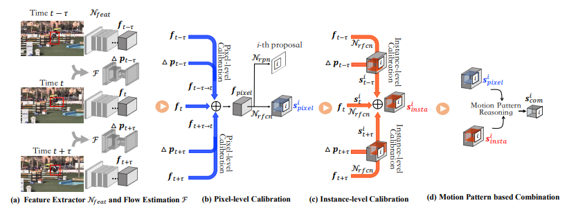

# Fully Motion-Aware Network for Video Object Detection

## Architecture

## Summary

Similar with [FGFA](https://arxiv.org/abs/1703.10025), but in addtion to pixel-level feature calibration and aggregagtion, [MANet](http://openaccess.thecvf.com/content_ECCV_2018/html/Shiyao_Wang_Fully_Motion-Aware_Network_ECCV_2018_paper.html) proposes the **motion pattern reasoning module** to dynamically combine (learnable soft weights) **pixel-level** and **instance-level** calibration according to the motion (optical flow by [FlowNet](https://arxiv.org/abs/1504.06852)). **Instance-level calibration** is achieved by regressing relative movements $(\Delta x , \Delta y , \Delta w , \Delta h)$ on the optical flow estimation according to proposal positions of reference frame. Final feaure maps for detection network ([R-FCN](https://arxiv.org/abs/1605.06409)) are the aggregation of nearby (13 frames in total) calibrated feature maps. Pixel-level calibration achieves better improvements for non-rigid movements while instance-level calibration is better for rigid movements and occlusion cases.
